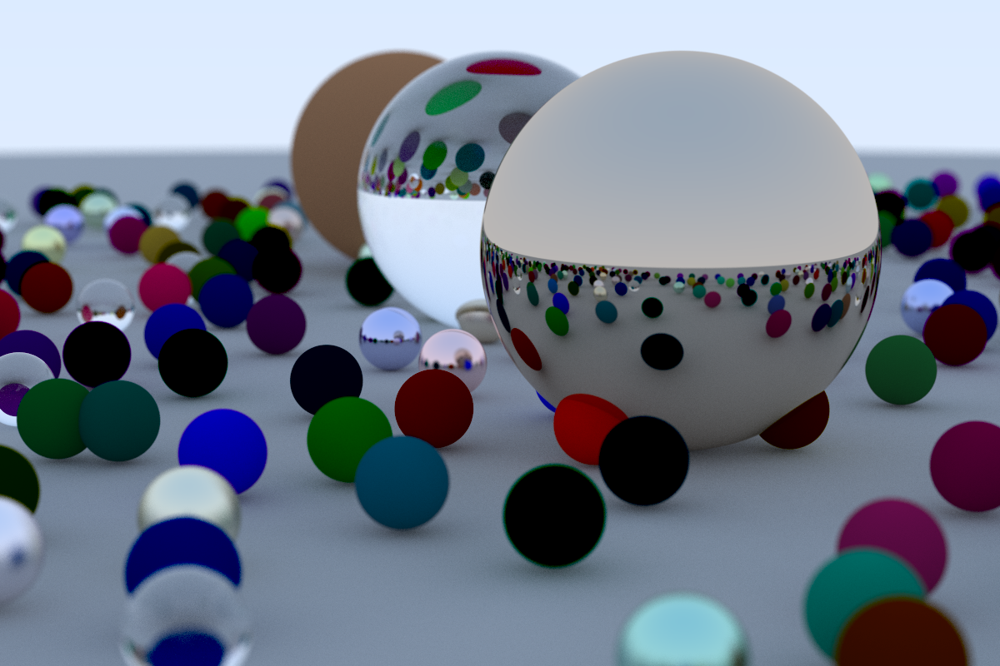

# Simple Ray Tracer

Simple ray tracing engine adapted from [_Ray Tracing in One Weekend_](https://raytracing.github.io/books/RayTracingInOneWeekend.html).

## Cloning
To make sure you're downloading submodules this engine uses, you should clone using the `--recursive` flag
```
git clone --recursive https://github.com/sfmalloy/ray-tracer.git
```

## Building
Dependencies:
- C++17
- glm
- stb (only stb_image_write.h)
- yaml-cpp
- Whatever threading library your compiler uses to implement std::future

`cmake` is required for building. To build
```
mkdir build
cd build
cmake ..
make
```
## Running
```
./src/RayTracer <image_name>.png <thread_count> [<scene>.yml]
```
To change camera settings, you currently have to edit `main.cpp`, but eventually I will add a way to do this from a seperate config file. You can however edit the objects in the scene by making a custom yaml file. See the `scenes` directory for examples on syntax. To render an example scene (e.g. three_spheres.yml) you can run:
```
./src/RayTracer three_spheres.png 1 ../scenes/three_spheres.yml
```


